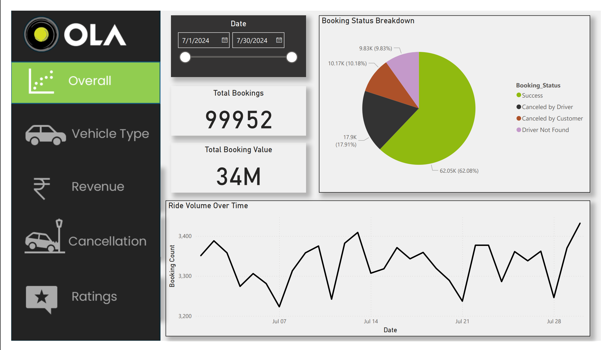
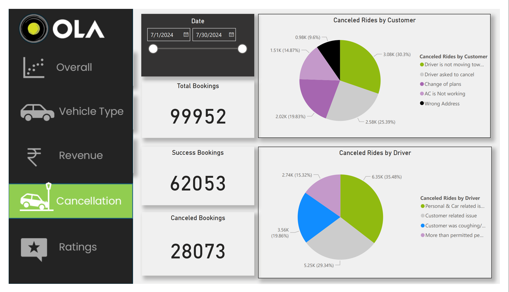
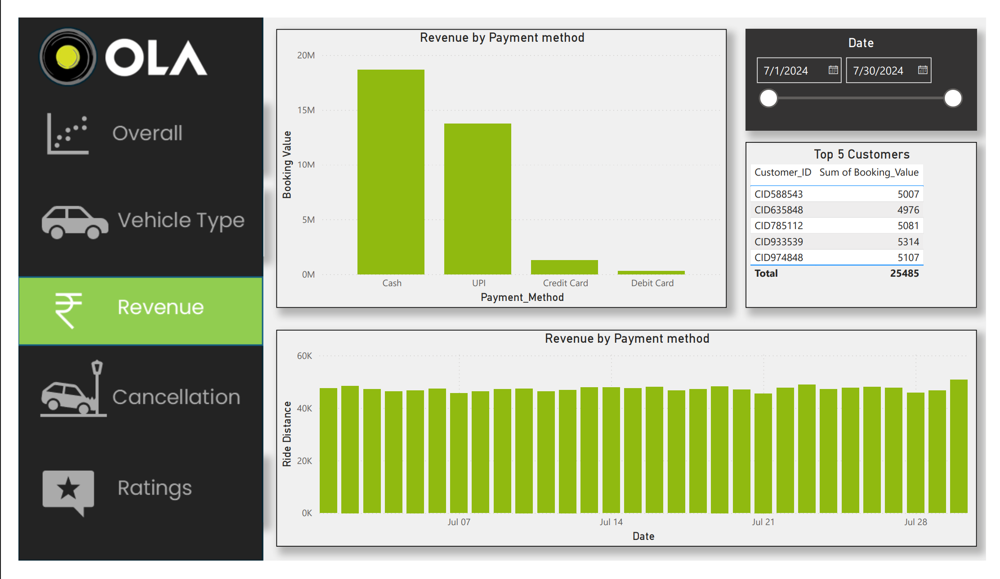
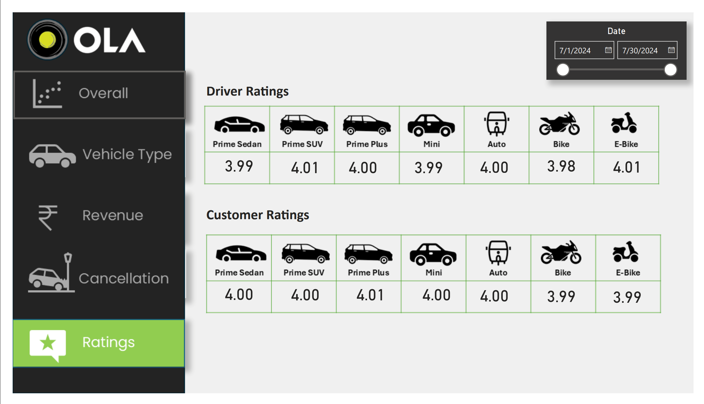

# Ola Data Analysis Project 🚖

##Overview
This project analyses Ola ride data using **SQL** for data cleaning and querying, and **Power BI** for creating dashboards. The analysis explores ride demand, peak hours, customer behaviour, and pricing trends. The goal is to turn raw data into clear insights that can support business decisions and highlight performance drivers.  

## Tools Used  
SQL (data cleaning, queries, and exploration)  
Power BI (interactive visualisations and dashboards)  

## Dashboards 📊  
Below are snapshots of the Power BI dashboards created in this project:  

### Overall
  

### Vehicle Type 
  

### Cancelation
  

### Revenue
  

### Ratings
  

## Full Dashboard  
For a complete view of the dashboards, you can download the PDF:  
[📥 Download Dashboard PDF](visualizations/ola_dashboard.pdf)  

## Dataset Disclaimer  
The dataset used in this project was sourced publicly for educational purposes (via YouTube). It may not represent actual Ola data. Only a sample has been included where possible.  
